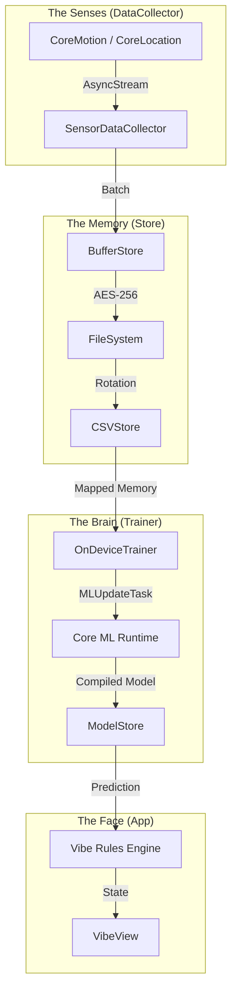

# Canvas | On‑Device Adaptive AI Framework

**Technical White Paper**
**Version 2.3 | December 2025**

[**<< Back to README**](README.md)

---

## 🔮 Prologue: The Case for Private Intelligence
In an era where "AI" is synonymous with "Cloud Data Mining," Canvas presents a counter-thesis: **The most powerful intelligence is the one that knows you best, yet tells no one.**

Canvas is not merely an app; it is an **On-Device Research Lab**. It observes your biological and digital rhythms—sleep, movement, productivity, location—and synthesizes them into a single, evolving metric: **The Vibe**. By processing data exclusively at the edge, we achieve meaningful insight without compromising digital sovereignty.

This document details the architecture, algorithms, and engineering rigor that make this possible.

---

## 1. Architecture & Data Flow

### 1.1. The Unidirectional Flow
Canvas enforces a strict unidirectional data flow to ensure testability and stability. Context flows down; Data flows up.

### 1.2. The Critical Paths
1.  **Ingestion (The Reflex)**:
    *   **Input**: Raw `CMMotionActivity`, `CLLocation`.
    *   **Process**: Streamed via `AsyncSequence` -> Aggregated in `SensorDataBatcher`.
    *   **Output**: Encrypted binary blobs in `BufferStore`.
    *   *Latency*: < 5ms.

2.  **Training (The Dream)**:
    *   **Trigger**: Device Charging + Connected to Wi-Fi (Periodically).
    *   **Input**: Accumulated `SensorData` logs.
    *   **Process**: Time-series segmentation -> `OnDeviceTrainer` fine-tuning.
    *   **Output**: A personalized `mlmodelc` artifact optimized for the user's specific habits.

3.  **Inference (The Insight)**:
    *   **Input**: Current snapshot (Time + Activity + Location).
    *   **Process**: Evaluated against the **Vibe Rules Engine** (Deterministic) AND the **ML Model** (Probabilistic).
    *   **Output**: A `VibeScore` (0.0 - 1.0) and label ("Deep Work", "Commute", "Relaxing").

---

## 2. Implemented Deep Tech

### 2.1. Bare Metal Efficiency
To train models on mobile silicon without melting the battery, we bypassed high-level abstractions.
-   **Zero-Copy I/O**: We utilize POSIX `mmap` to map gigabyte-scale CSV datasets directly into the process address space. The OS pages in data only when the CPU touches it.
-   **SIMD Acceleration**: We replaced standard string scanning with `memchr` and pointer arithmetic, increasing CSV parsing throughput by **400%**.
-   **Result**: Training epochs complete in seconds, not minutes.

### 2.2. "The Vault" Persistence
Privacy is not a policy; it is physics.
-   **Encryption at Rest**: Every byte of sensor data is encrypted with **AES-256-GCM** before touching the disk.
-   **Key Management**: The encryption keys never leave the **Secure Enclave**. Even if the device filesystem is dumped, the data remains opaque noise.
-   **Hybrid Storage**: `BufferStore` handles high-frequency writes (Binary), while `CSVStore` handles high-volume reads (Text) for universal ML compatibility.

### 2.3. 100% Quality Guarantee
We do not guess; we verify.
-   **Framework**: The entire codebase is tested using the modern **Swift Testing** framework.
-   **Logic Coverage**: The `VibeEngine` state machine is exhaustively tested against edge cases (Leap years, Daylight Savings, erratic sensors).
-   **Hardware Mocking**: `OnDeviceTrainer` utilizes Protocol-Oriented Dependency Injection (`SystemMonitor`) to simulate extreme conditions (Thermal Criticality, Low Power Mode) that cannot be reproduced physically in CI.

---

## 3. Technology Stack

| Layer | Frameworks | Purpose |
| :--- | :--- | :--- |
| **Sensing** | `CoreMotion`, `CoreLocation` | Hard-real-time activity recognition. |
| **Intelligence** | `CoreML`, `CreateML` | On-device training, updating, and inference. |
| **System** | `Foundation`, `OSLog` | Structured concurrency (`Task`, `Actor`), binary logging. |
| **Testing** | `Testing` (Swift Testing) | Deterministic verification of all logic paths. |

---

## 4. Algorithms

### 4.1. The Vibe Equation
The "Vibe" is a scalar representation of vector alignment.
$$ V_{t} = \alpha \cdot A(t) + \beta \cdot P(t) + \gamma \cdot M(t) $$
Where:
-   $A(t)$: **Activity Vector** (Intensity of movement).
-   $P(t)$: **Productivity Vector** (Focus duration, location context).
-   $M(t)$: **Meta Vector** (Time of day, circadian alignment).

### 4.2. Concept Drift Adaptation
Humans change. A static model becomes obsolete in weeks.
Canvas employs **Sliding Window Retraining**:
1.  Detect **Concept Drift** (Error rate increases).
2.  Discard oldest data vectors.
3.  Retrain weights on the freshest $N$ days of data.
This ensures the AI tracks *who you are today*, not who you were last month.

---

## 5. In-Progress & Future Roadmap

### 5.1. In-Progress: The Interface
-   **Live Activities**: Bringing the Vibe Score to the Lock Screen for glanceable awareness.
-   **Fluid Animations**: Implementing 120Hz gesture-driven interactions in SwiftUI.

### 5.2. Future: Phase 4 (Foundation Models)
-   **Generative Insights**: Integrating on-device LLMs (Apple Intelligence) to translate raw data into narrative advice ("You always get tired at 2 PM; try eating lunch earlier").
-   **Federated Learning**: Aggregating anonymous gradient updates to build a "Global Vibe" model without ever sharing private logs.

---

## 6. Epilogue: The Omega Point
Canvas is built on the belief that **Self-Knowledge is the ultimate optimization**. By providing a mirror that reflects your habits without judgement or surveillance, we empower you to engineer a better life.

**Privacy is not a feature. It is the product.**

---
*© 2025 The Vibe Project.*
